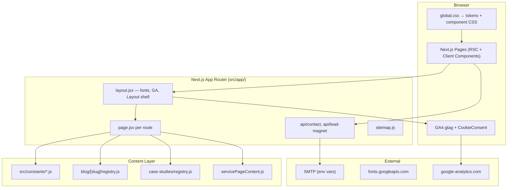

# ExcelAccessConsultant.com — AI Handoff: Project Status & Architecture

> **Purpose:** Single source of truth for AI assistants continuing work on this repo.
> **Last updated:** June 11, 2026
> **Repo:** `/Users/shivramrana/Documents/ExcelAcessConsultant`
> **Branch:** `shiv` (large uncommitted local changes — see §16)

---

## 1. Executive Summary

**ExcelAccessConsultant.com** is a B2B lead-generation marketing site for **Robert Terry**, a USA-based Microsoft Excel VBA and Access database consultant (Springville, Utah). The site targets organic search traffic and converts visitors via contact form, phone calls, lead magnets, and ROI calculator.

| Goal | Target |
|------|--------|
| Qualified leads | 15+/month within 6 months |
| Current estimate | 3–5 leads/month, <500 organic sessions/month |
| Primary conversion | Contact form, `tel:` clicks, email clicks |
| Secondary | Lead magnet signup, calculator use, case study reads |

**Business contact (canonical in code):**

| Field | Value |
|-------|-------|
| Phone | `+1 385-386-3860` (`tel:+13853863860`) |
| Email | `rob@excelaccessconsultant.com` |
| Site URL | `https://excelaccessconsultant.com` |
| GA4 ID | `G-9ZT461HGG8` |
| Founder | Robert Terry (`src/constants/site.js`) |
| Experience claims | 20+ years, 500+ projects (`TRUST` in `site.js`) |

---

## 2. Tech Stack (Actual — June 2026)

> **⚠️ Outdated references:** `.cursorrules`, `docs/PROJECT_CONTEXT.md`, and `design-system/excelaccessconsultant/MASTER.md` still mention React Router, Express backend, Tailwind, and IBM Plex Sans. **Ignore those.** The live stack is below.

| Layer | Technology |
|-------|------------|
| Framework | **Next.js 16** (App Router) |
| React | 18.x |
| Routing | File-based `src/app/**/page.jsx` |
| Styling | **Vanilla CSS** + design tokens (`src/app/styles/`) — **no Tailwind** |
| Fonts | **Manrope** (Google Fonts), fallback Plus Jakarta Sans |
| Email API | **Nodemailer** via Next.js Route Handlers |
| Analytics | Google Analytics 4 + consent gating |
| Package manager | npm |
| Dev server port | **5063** (`package.json` / `.env.example`) |

**Scripts:**

```bash
npm run dev      # next dev -p 5063
npm run build    # next build
npm run start    # next start -p 5063
npm run lint     # eslint
```

---

## 3. High-Level Architecture



### Request flow (contact form)

1. User fills 2-step form on `/contact` (client component logic in `page.jsx`).
2. `POST /api/contact` with JSON body.
3. Route handler: IP rate limit (in-memory Map, 5/15min) → validation → Nodemailer → JSON response.
4. Client shows toast; on success redirects to `/thank-you`.
5. `trackFormSubmit(service)` fires GA event.

---

## 4. Directory Structure

```
ExcelAcessConsultant/
├── src/
│   ├── app/                          # Next.js App Router
│   │   ├── layout.jsx                # Root layout, GA, fonts, <Layout>
│   │   ├── page.jsx                  # Homepage
│   │   ├── components/
│   │   │   ├── Layout.jsx            # Header, nav, footer, sliding indicator
│   │   │   └── Breadcrumb.jsx
│   │   ├── styles/                   # ALL styling lives here
│   │   │   ├── global.css            # Imports tokens + components
│   │   │   ├── tokens/design-tokens.css
│   │   │   ├── base/, layout/, utilities/
│   │   │   └── components/           # Button, header, homepage, pages, etc.
│   │   ├── api/
│   │   │   ├── contact/route.js
│   │   │   └── lead-magnet/route.js
│   │   ├── blog/
│   │   │   ├── page.jsx              # Blog index
│   │   │   ├── [slug]/               # Dynamic posts + registry.js
│   │   │   └── categories/[category]/
│   │   ├── case-studies/
│   │   │   ├── page.jsx, [slug]/, registry.js
│   │   ├── services/[slug]/          # Re-exports service pages (duplicate URLs)
│   │   └── [route]/page.jsx          # One folder per static route
│   ├── components/                   # Shared React components
│   │   ├── ui/                       # Button, Card, FAQAccordion, etc.
│   │   ├── SEO/                      # SEO, schemas, CookieConsent
│   │   ├── Analytics/                # Event trackers
│   │   ├── HomeHero/, HomeBelowHero/, LeadMagnet/, ROICalculator/
│   │   └── BrandLogo/, BrandSubline/
│   ├── constants/                    # Page copy & config (prefer editing here)
│   ├── config/brand.js               # SITE_URL, logo paths, BRAND_COLORS
│   └── utils/analytics.js            # GA event helpers
├── public/
│   ├── downloads/                    # HTML lead-magnet files
│   ├── eaclogo.png, logo.png, logo.webp, favicons
│   └── robots.txt
├── design-system/excelaccessconsultant/  # Page design notes (partially outdated)
├── docs/                             # This file + deployment notes
├── .cursor/rules/                    # AI styling rules (authoritative for UI)
└── .cursorrules                      # SEO/business rules (some stack details outdated)
```

---

## 5. Routing Inventory

### 5.1 Core pages

| Path | File | Notes |
|------|------|-------|
| `/` | `src/app/page.jsx` | Homepage — hero, symptoms, problems, results, services, FAQ, CTA |
| `/about` | `about/page.jsx` | Redesigned June 2026 — `aboutPage.js` constants |
| `/contact` | `contact/page.jsx` | 2-step form, captcha, redesigned June 2026 |
| `/faq` | `faq/page.jsx` | 3 FAQ sections; **no bottom PageCTASection** |
| `/pricing` | `pricing/page.jsx` | Pricing tiers + `PricingTierGrid` |
| `/thank-you` | `thank-you/page.jsx` | Post-form confirmation |
| `/privacy-policy` | `privacy-policy/page.jsx` | Legal |

### 5.2 Service pages (canonical URLs)

Each has `page.jsx` + `layout.jsx` (exports `metadata`). Also reachable via `/services/[slug]` (re-export wrapper).

| Path | Accent color |
|------|--------------|
| `/excel-automation` | Primary (green) |
| `/access-consulting` | Secondary (crimson) |
| `/access-database-repair` | Secondary |
| `/database-migration` | Secondary |
| `/vba-development` | Primary |
| `/financial-modeling` | Primary |

Service copy: `src/constants/servicePageContent.js`
Shared sections: `src/components/ui/ServicePageSections/ServicePageSections.jsx`

### 5.3 SEO / landing pages

| Path | Purpose |
|------|---------|
| `/excel-consultant-utah` | Local SEO — `utahPage.js` |
| `/hire-excel-vba-consultant` | Hire-intent landing |

### 5.4 Resources & lead magnets

| Path | Component / notes |
|------|-------------------|
| `/free-checklist` | `LeadMagnetHub` |
| `/free-resources` | Same hub |
| `/resources/free-checklist` | Same hub |
| `/resources/calculator` | `ROICalculator` |
| `/resources/faq` | Re-exports `/faq` |

Lead magnet data: `src/constants/leadMagnets.js` (3 guides)
Downloads: `public/downloads/*.html`

### 5.5 Content

| Path | Count | Registry |
|------|-------|----------|
| `/blog` | Index | `blogPosts.js`, `blogCategories.js` |
| `/blog/[slug]` | **13 canonical posts** | `blog/[slug]/registry.js` |
| `/blog/categories/[category]` | 3 categories | `blogCategories.js` |
| `/blog/2026/01/[legacySlug]` | Legacy dated URLs | `LEGACY_DATED_BLOG_SLUGS` in registry |
| `/case-studies` | Index | — |
| `/case-studies/[slug]` | **6 case studies** | `case-studies/registry.js` |

Blog slug aliases and legacy redirects are defined in `registry.js` (`BLOG_SLUG_ALIASES`, `LEGACY_DATED_BLOG_SLUGS`).

### 5.6 Legacy `.html` routes

Several `*.html/page.jsx` files re-export canonical pages for old URLs (e.g. `contact.html`, `faq.html`, `about.html`). Do not delete without redirect strategy.

### 5.7 Sitemap

`src/app/sitemap.js` generates entries for static routes, services, case studies, blog posts (including aliases), categories, and legacy blog paths.

---

## 6. Layout & Navigation

**File:** `src/app/components/Layout.jsx`
**Styles:** `src/app/styles/components/header.css`

### Header structure

- Logo → `BrandLogo` (`/eaclogo.png`)
- Center nav: Services (dropdown), Case Studies, Pricing, Blog, Contact
- Right CTA: "Book Free Consultation" → `/contact`
- Mobile: hamburger + slide-out menu

### Sliding nav indicator (June 2026)

- Element: `.site-nav__indicator`
- Positioned via `useLayoutEffect` + `getBoundingClientRect` on hover/active
- Returns to active route on `mouseleave`
- **Hidden on homepage** when no nav item matches (`getActiveNavId()` returns `null`)
- Active style: light green pill (`var(--color-primary-50)` + green border/text), not solid dark green
- Nav offset from logo: `left: calc(50% + 1.75rem)`; logo/CTA use `var(--space-8)` margins

### Footer

- Service links, resources, contact info, privacy link
- Uses `CTA` and `CONSULTANTS` from `site.js`

---

## 7. Design System (Authoritative — Flat UI, June 2026)

**Read first:** `.cursor/rules/ui-flat-design-system.mdc`, `.cursor/rules/homepage-section-patterns.mdc`, `.cursor/rules/css-styling.mdc`

### 7.1 Non-negotiable rules

| Rule | Detail |
|------|--------|
| **No gradients** | No `linear-gradient`, `radial-gradient`, gradient text, ambient glow orbs |
| **No blue accents** | Removed from design system |
| **Flat buttons** | Solid fill; hover = color change + soft shadow; active = `opacity: 0.92` or `scale(0.98)` |
| **No glass/blur** | No `backdrop-filter`, `home-cta-premium`, glass cards |
| **Banned classes** | `problem-card`, `service-tile`, `icon-wrap--glow`, inset nav shadows, top accent bars on cards |

### 7.2 Brand colors (CSS variables in `design-tokens.css`)

| Token | Hex | Usage |
|-------|-----|-------|
| `--color-primary` | `#1B5E20` | Excel green — CTAs, nav, general pages |
| `--color-primary-hover` | `#155016` | Hover |
| `--color-secondary` | `#8B1A1A` | Access crimson — Access service pages only |
| `--color-secondary-hover` | `#6E1515` | Access hover |
| `--color-charcoal` / `--color-text` | `#2D2D2D` | Body text |
| `--color-primary-50` | `#F0F7F1` | Chips, nav active pill, light accents |
| `--color-secondary-50` | `#FFF0F0` | Access chips |

Button component uses slightly lighter `--color-btn-primary` (`#2E7D32`) for default button fill.

### 7.3 Card & section patterns

| Class / Component | Use |
|-------------------|-----|
| `cs-result-card` + `--primary`/`--secondary` | Featured 3-up cards (problems, client results) |
| `cs-item` + `--primary`/`--secondary` | Compact grids (services, case studies, links) |
| `chip-primary` / `chip-secondary` | Category labels on cards |
| `fact-card` | 2-up principle cards (about, utah) |
| `process-card` | How-it-works steps |
| `page-hero` | Inner page hero band |
| `FAQAccordion` + `faq-item` | All FAQ sections (numbered `cs-item__num` pills) |
| `PageCTASection` | Bottom CTAs — `solidPrimary` on homepage, default light on inner pages |
| `ScrollReveal` | Section entrance animations |
| `ResultCardCTA` | Card footer links with animated arrow (`cta-arrow-run`) |
| `ContactCTAs` | Phone + primary CTA pair; `center` prop; `green` → `primary-green` variant |

### 7.4 Typography

- Font: Manrope (weights 400–800)
- Utility classes in `base/typography.css`: `text-display-*`, `text-heading-*`, `text-body-*`, `text-label-*`
- H1 pattern: `text-display-lg md:text-display-xl lg:text-display-2xl`
- Spacing: 4px base unit; semantic `space-sm`, `space-md`, `space-lg`, etc.

### 7.5 Buttons

**Component:** `src/components/ui/Button/Button.jsx`
**CSS:** `src/app/styles/components/Button.css`

Variants map to BEM classes: `btn--primary`, `btn--secondary`, `btn--outline-green`, `btn--outline-white`, `btn--ghost`, etc.

---

## 8. Homepage Architecture

**File:** `src/app/page.jsx`

| Section | Source | Pattern |
|---------|--------|---------|
| Hero | `HomeHero`, `homeHero.js` | Authority, proof outcomes, visual |
| Sound Familiar? | `HomeCommonProblems`, `HOME_SYMPTOM_GROUPS` | Two checklist panels (Access \| Excel) — symptom scan |
| Problems I Solve | `HOME_CONVERSION_PROBLEMS` in `homeConversion.js` | 3× `cs-result-card` with before/after |
| Why teaser | `HomeWhyTeaser` | — |
| Client Results | `homeConversion.js` | `cs-result-card` + `ResultCardCTA` |
| Services | `cs-item` grid | Links to service pages |
| Industries / trust | Various constants | — |
| ROI calculator | `ROICalculator` (lazy) | `LazyWhenVisible` |
| FAQ | `HomeFAQSection`, `homeFaq.js` | `FAQAccordion` |
| Final CTA | `PageCTASection` | `solidPrimary` |

**Key distinction:** "Sound Familiar?" = quick symptoms; "Problems I Solve" = outcome-focused featured cards. Intentionally not duplicate.

---

## 9. Component Inventory

### 9.1 UI primitives (`src/components/ui/`)

| Component | Path | Role |
|-----------|------|------|
| Button | `Button/Button.jsx` | All CTAs |
| Card | `Card/Card.jsx` | Generic card wrapper |
| CheckList | `CheckList/CheckList.jsx` | Checkmark lists |
| ContactCTAs | `ContactCTAs/ContactCTAs.jsx` | Phone + consultation buttons |
| FAQAccordion | `FAQAccordion/FAQAccordion.jsx` | Accessible accordion |
| Icons | `Icons/Icons.jsx` | SVG icon set |
| PageCTASection | `PageCTASection/PageCTASection.jsx` | Bottom CTA bands |
| PricingTierGrid | `PricingTierGrid/PricingTierGrid.jsx` | 3-tier pricing |
| ResultCardCTA | `ResultCardCTA/ResultCardCTA.jsx` | Animated arrow link on cards |
| ScrollReveal | `ScrollReveal/ScrollReveal.jsx` | Intersection observer animations |
| ServicePageSections | `ServicePageSections/` | Reusable service page blocks |
| ServicePricingSection | `ServicePricingSection/` | Service pricing block |
| Toast | `Toast/` | Form feedback |

### 9.2 SEO & analytics (`src/components/SEO/`, `Analytics/`)

| Component | Role |
|-----------|------|
| `SEO.jsx` | Meta title, description, canonical, OG, Twitter |
| `FAQSchema.jsx` | FAQ JSON-LD |
| `ServiceSchema.jsx` | Service JSON-LD |
| `ArticleSchema.jsx` | Blog post JSON-LD |
| `ReviewSchema.jsx` | Testimonial JSON-LD |
| `BreadcrumbSchema.jsx` | Breadcrumb JSON-LD |
| `CookieConsent.jsx` | GA consent (`analytics_storage`) |
| `TrustBadge.jsx` | Trust signals |
| `DataSecurityDisclaimer.jsx` | Form security note |
| `AnalyticsListener.jsx` | Route change page views |
| `BlogReadTracker.jsx` | 75% scroll → `blog_read` |
| `CaseStudyTracker.jsx` | `case_study_view` |

### 9.3 Feature components

| Component | Role |
|-----------|------|
| `HomeHero/*` | Homepage hero |
| `HomeBelowHero/*` | Symptoms, why teaser |
| `HomeFAQSection` | Homepage FAQ |
| `LeadMagnet/*` | Hub + email capture |
| `ROICalculator` | Savings calculator |
| `BrandLogo`, `BrandSubline` | Branding |
| `LazyWhenVisible` | Below-fold lazy mount |

---

## 10. Constants & Content Layer

Prefer editing these files over hardcoding copy in JSX.

| File | Contents |
|------|----------|
| `site.js` | `CONSULTANTS`, `TRUST`, `CTA`, `SERVICE_SIDEBAR_TAGLINES` |
| `homeConversion.js` | `HOME_SYMPTOM_GROUPS`, problems, client results |
| `homeHero.js` | Hero copy |
| `homeFaq.js` | Homepage FAQ items |
| `homeTestimonials.js` | Testimonials |
| `servicePageContent.js` | All service page sections |
| `serviceRoutes.js` | `SERVICE_SLUGS`, canonical URLs |
| `pricingPageContent.js` | Pricing page |
| `leadMagnets.js` | 3 lead magnet definitions |
| `aboutPage.js` | About page sections |
| `contactPage.js` | Contact page copy + channel cards |
| `faqPage.js` | FAQ sections (flat list for schema) |
| `utahPage.js` | Utah landing page |
| `blogPosts.js` | Blog index metadata |
| `blogCategories.js` | Category definitions |
| `iconSizes.js` | Icon dimension tokens |
| `config/brand.js` | `SITE_URL`, logo assets, `BRAND_COLORS` |

---

## 11. Blog System

### Registration pattern

1. Add post component in `src/app/blog/[slug]/posts/MyPost.jsx`
2. Register in `registry.js`:
   - `POST_META[slug]` — SEO metadata
   - `POST_COMPONENTS[slug]` — dynamic import
3. Add to `blogPosts.js` for index listing (if not auto-derived)
4. Sitemap auto-includes via `ALL_SLUGS`

### Canonical posts (13)

- `10-signs-you-need-excel-automation`
- `why-your-access-database-keeps-crashing`
- `excel-automation-cost-what-to-expect`
- `how-to-speed-up-slow-excel-spreadsheets`
- `access-vs-sql-server-when-to-migrate`
- `common-excel-vba-mistakes-and-how-to-fix-them`
- `financial-modeling-best-practices`
- `excel-reporting-automation-complete-guide`
- `access-database-repair-guide`
- `is-microsoft-access-still-relevant-2026`
- `access-vs-power-apps-when-to-stay-on-access`
- `when-to-migrate-from-access`
- `access-vs-excel-when-to-use-each`

### Blog post shell

- `BlogPostShell.jsx`, `BlogPostSidebar.jsx`, `BlogPostCTA.jsx`
- Sidebar config: `blogSidebarConfig.js`
- Target: 1,500–2,000 words, FAQ section, internal links, author Robert Terry

**Gap vs `.cursorrules` goal:** 24 posts target — **13 live**, 11 remaining.

---

## 12. Case Study System

**Registry:** `src/app/case-studies/registry.js`

### Case studies (6)

1. `manufacturing-inventory-tracking` — Access crash fix, 15 users
2. `construction-automated-reporting` — Reporting automation
3. `financial-services-data-integration` — Finance close automation
4. `distribution-slow-spreadsheet` — Slow spreadsheet fix
5. `retail-pricing-system` — Pricing system
6. `access-sql-migration-enterprise` — SQL migration

Slug aliases: `manufacturing-automation`, `finance-close-automation`, `operations-consolidation`

**Shell:** `CaseStudyShell.jsx`, `CaseStudySidebar.jsx`, `CaseStudyContent.jsx`

---

## 13. API Routes

### `POST /api/contact`

**File:** `src/app/api/contact/route.js`

| Feature | Implementation |
|---------|----------------|
| Rate limit | In-memory Map, 5 req/IP/15 min |
| Validation | name, email, message required; email format |
| Email | Nodemailer → `TO_EMAIL` |
| Fields | name, email, phone, company, message, service, hoursPerWeek, bestTimeToCall |
| Env | `SMTP_*`, `FROM_EMAIL`, `TO_EMAIL` |

### `POST /api/lead-magnet`

**File:** `src/app/api/lead-magnet/route.js`

- Email capture for PDF guides
- Same SMTP pattern
- `trackLeadMagnetSignup(resource)` on client

### Environment variables (`.env.example`)

```
PORT=5063
NODE_ENV=development
SMTP_HOST=
SMTP_PORT=587
SMTP_SECURE=false
SMTP_USER=
SMTP_PASS=
FROM_EMAIL=
TO_EMAIL=
```

---

## 14. Analytics Events

**Helper:** `src/utils/analytics.js`

| Event | Function | When |
|-------|----------|------|
| `phone_click` | `trackPhoneClick(location)` | `tel:` link clicks |
| `email_link_click` | `trackEmailClick(location)` | `mailto:` clicks |
| `form_submit` | `trackFormSubmit(service)` | Contact form success |
| `calculator_use` | `trackCalculatorUse(savings)` | ROI calculator submit |
| `case_study_view` | `trackCaseStudyView(slug)` | Case study page |
| `service_page_view` | `trackServicePageView(service)` | Service pages |
| `blog_read` | `trackBlogRead(slug)` | 75% scroll on blog |
| `lead_magnet_signup` | `trackLeadMagnetSignup(resource)` | Lead magnet form |

**Note:** `PageCTASection` does **not** accept `phoneLocation` prop (passed in some pages but ignored). `ContactCTAs` supports location via click handlers where wired.

**Consent:** Default `analytics_storage: 'denied'` until `CookieConsent` accepts.

---

## 15. SEO Requirements (Per Page)

Every page should have:

- Unique `<title>` (≤60 chars) and meta description (≤155 chars)
- Canonical URL
- Open Graph + Twitter Card tags (`SEO.jsx` or `layout.jsx` metadata)
- Proper H1 with primary keyword
- Schema: LocalBusiness (home), Service (service pages), FAQPage, Article, Review as applicable
- 3–5 internal links
- Alt text on images
- Mobile responsive

**Service page template sections:** intro, what I do (bullets), how it works (5 steps), pricing (3 tiers), FAQs, case snippets, final CTA.

---

## 16. Git & Deployment State

| Item | Status |
|------|--------|
| Branch | `shiv` |
| Last commit | `5eda090` — "Implement comprehensive SEO overhaul (10 tasks)" |
| Local changes | **Large uncommitted set** — June 2026 flat UI redesign, new components, nav indicator, page rewrites, new routes |
| Deployment | IIS `web.config` present; see `docs/DEPLOYMENT_CHECKLIST.md` |

**Do not assume remote matches local.** Run `git status` before any deploy.

---

## 17. Project Status vs Goals

### ✅ Substantially complete

| Area | Status |
|------|--------|
| Next.js App Router migration | Done |
| Vanilla CSS design token system | Done |
| 6 service pages + `/services/[slug]` aliases | Done |
| Homepage conversion sections | Done (June 2026 refresh) |
| Contact 2-step form + API | Done |
| Lead magnet hub (3 guides) | Done |
| About, Contact, FAQ, Utah redesigns | Done (June 2026) |
| Nav sliding indicator | Done |
| Case studies (6) | Done (exceeds original 3 target) |
| Blog (13 posts) | Partial — target was 24 |
| GA4 + event helpers | Done |
| Sitemap + robots.txt | Done |
| Cookie consent | Done |
| ROI calculator | Done |
| Pricing page | Done |

### ⚠️ In progress / gaps

| Area | Gap |
|------|-----|
| Blog content | 13/24 posts |
| Lead magnet email automation | API exists; ConvertKit/Mailchimp integration TBD |
| Documentation sync | `.cursorrules`, `PROJECT_CONTEXT.md`, `MASTER.md` outdated (Tailwind, React Router, old fonts) |
| Technical SEO audit | Screaming Frog checklist in `.cursorrules` largely unchecked |
| Google Search Console | Manual setup |
| Backlinks / GBP / reviews | Ongoing marketing, not code |
| Rate limiting | In-memory only — not multi-instance safe |
| `phoneLocation` tracking | Inconsistent — prop ignored on some components |

### 🚫 Do not reintroduce

- Tailwind utility classes (removed)
- Gradients, glass morphism, 3D button press effects
- Blue accent colors
- Duplicate homepage problem sections
- `PageCTASection` on FAQ (explicitly removed per user request)

---

## 18. Page Redesign Status (June 2026)

| Page | Status | Constants file |
|------|--------|----------------|
| Homepage | ✅ Refreshed | `homeConversion.js`, `homeHero.js` |
| About | ✅ Redesigned | `aboutPage.js` |
| Contact | ✅ Redesigned | `contactPage.js` |
| FAQ | ✅ Redesigned (no bottom CTA) | `faqPage.js` |
| Excel Consultant Utah | ✅ Redesigned | `utahPage.js` |
| Free checklist / resources | ✅ Redesigned | `leadMagnets.js` |
| Resources calculator | ✅ Matched `page-hero` pattern | — |
| Service pages | ✅ Using `ServicePageSections` | `servicePageContent.js` |
| Pricing | ✅ | `pricingPageContent.js` |
| Blog posts | ✅ Shell unified | per-post JSX |
| Case studies | ✅ Shell unified | `registry.js` |
| Hire Excel VBA consultant | ⚠️ Verify against new patterns | — |

---

## 19. Conventions for AI Assistants

1. **Styling:** Edit CSS in `src/app/styles/components/`, not inline styles. Use design tokens.
2. **Copy:** Add to `src/constants/`, import in page JSX.
3. **New pages:** Create `src/app/[route]/page.jsx` + `layout.jsx` with `metadata` export; add to `sitemap.js`.
4. **New blog post:** Component + `registry.js` + `blogPosts.js` + internal links.
5. **Cards:** Use `cs-result-card` or `cs-item` — never invent new card systems.
6. **CTAs:** Use `PageCTASection`, `ContactCTAs`, `Button` — not raw `<a class="btn">` unless matching existing patterns.
7. **Access vs Excel color:** Secondary crimson only on Access-related pages; primary green elsewhere.
8. **No commits** unless user explicitly asks.
9. **Dev URL:** `http://localhost:5063` (not 3000).
10. **Read rules:** `.cursor/rules/ui-flat-design-system.mdc` before any UI work.

---

## 20. Key File Quick Reference

```
src/app/page.jsx                          # Homepage
src/app/components/Layout.jsx             # Header, nav, footer
src/app/styles/components/header.css      # Nav + indicator
src/app/styles/components/homepage.css    # Card system
src/app/styles/components/pages.css       # Contact, FAQ, lead magnet
src/app/styles/tokens/design-tokens.css   # All CSS variables
src/constants/site.js                       # CTA, TRUST, CONSULTANTS
src/config/brand.js                       # URL, logo
src/utils/analytics.js                    # GA events
src/app/blog/[slug]/registry.js           # Blog routing
src/app/case-studies/registry.js          # Case study data
src/app/sitemap.js                        # Sitemap generation
src/app/api/contact/route.js              # Contact form API
```

---

## 21. Known Inconsistencies (Fix When Touching)

| Location | Issue |
|----------|-------|
| `.cursorrules` | Says React Router + Express + IBM Plex Sans + 15 years — wrong |
| `docs/PROJECT_CONTEXT.md` | Likely outdated stack/colors |
| `design-system/.../MASTER.md` | Says Tailwind; mentions glass effects (now banned) |
| `.cursorrules` vs `site.js` | Rules say 15+ years; code says 20+ |
| Blog meta titles | Some say "2025" in slug `excel-automation-cost-what-to-expect` |
| `CONSULTANTS.founders` | Single founder; some old copy may reference team |

---

## 22. Related Docs

| File | Use |
|------|-----|
| `.cursorrules` | SEO, keywords, content requirements (verify stack sections) |
| `.cursor/rules/ui-flat-design-system.mdc` | UI rules — **authoritative** |
| `.cursor/rules/homepage-section-patterns.mdc` | Homepage section patterns |
| `design-system/excelaccessconsultant/pages/*.md` | Per-page design notes |
| `docs/theme.md` | Theme notes (may be partial) |
| `docs/DEPLOYMENT_CHECKLIST.md` | Deploy steps |

---

*End of handoff document. For conversation context on recent redesign work, see agent transcript `0e5f82ff-23bc-4623-b63e-83f6ae0a0c2b`.*
